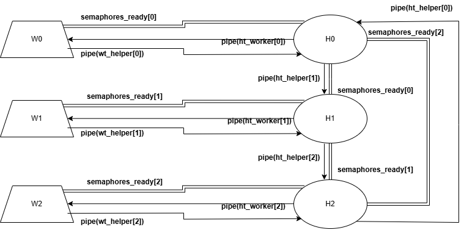

# Symulacja Problemu Producenta-Konsumenta z Workerami i Helperami

---
## Opis problemu

Problem producenta-konsumenta (ang. *Producer-Consumer Problem*) to klasyczny problem synchronizacji w programowaniu współbieżnym. Dotyczy sytuacji, w której:
- **producent** generuje dane i umieszcza je we wspólnym buforze,
- **konsument** pobiera dane z tego bufora do przetworzenia.

---
## Główne założenia projektu

- **Liczba procesów:**
  - `Workerów` – działających jako producenci i konsumenci.
  - `Helperów` – pośredników odpowiedzialnych za przekazywanie jednostek.

- **Wiadomości**
  - Komunikacja między procesami odbywa się poprzez przesyłanie między sobą wiadomości.
  - Aby uniknąć zakleszczenia liczba wiadomości w obiegu Helperów wynosi zawsze maksymalnie liczbie (`Workerów`/2) - na początku programu nieparzyści `Workerzy` produkują i wysyłają jednostkę a reszta `Workerów` czeka na **żądanie produkcji**.

- **Worker:**
  - Może albo produkować **jednostki z określonego zakresu** albo wysyłać **żądanie produkcji**.
  - Konsumuje **jednostki**, których typ odpowiada typowi jednostki jaką ten Worker już wyprodukował. Gdy skonsumuje jednostkę przestawia sie w tryb wysyłania żądania produkcji.
  - Gdy otrzyma **żądanie produkcji** przestawia się w tryb produkowania jednostek.

- **Helper:**
  - Posiada **bufor**, w którym może przechować tylko jedną wiadomość.
  - Odbiera i wysyła wiadomości do `Workera`.
  - Jeśli jednostka nie pasuje do żądania, **przekazuje ją dalej** do kolejnego `Helpera` w pierścieniu.
  - Wiadomość można przesłać dalej jeśli **semafor gotowości** następnego `Helpera` na to pozwala (semafor musi mieć wartość 1 - oznacza, że `Helper` ma pusty bufor).
  - Przesyła jednostkę do swojego `Workera`, jeśli pasuje do oczekiwanego typu, czyli jeśli typ jest taki sam jak ten wyprodukowany przez `Workera`.

- **Jednostki w systemie:**
  - Każda jednostka przyjmuje określony typ.
  - To ile jest typów określane jest przez to ile maksymalnie jednostek może znajdować się w obiegu między Helperami i wynosi = **Maksymalna liczba jednostek - 1**. Dzięki temu nie zajdzie sytuacja, w której jednostki krążą między Helperami i nie mogą być skonsumowane przez żadnego Workera.

- **Mechanizm przekazywania i synchronizacji:**
  - Helperzy tworzą zamknięty **pierścień komunikacyjny** – każdy może przekazać jednostkę dalej.
  - Przed przekazaniem jednostki, `Helper` sprawdza za pomocą semafora, czy kolejny `Helper` jest gotowy na odbiór.
  - Każdy `Helper` posiada swój **semafor gotowości (`/readyX`)**, który sygnalizuje gotowość do przyjęcia danych.

Każdy `Worker` i `Helper` ma zdefiniowane kanały komunikacji (pipe) oraz semafor gotowości. System został zaprojektowany w taki sposób, że:
- jednostki nie są przechowywane na długo,
- każda jednostka krąży w systemie do momentu, aż trafi do `Workera`, który jej potrzebuje.

**Ograniczenia i synchronizacja**

- Aby `Helper` przekazał jednostkę dalej, musi sprawdzić semafor kolejnego `Helpera`.
- Ograniczenie liczby jednostek w systemie (tyle co Workerów) zapewnia stabilność i brak przepełnienia.

---

###  Struktury komunikacyjne

- **Pipes (potoki)** – jednokierunkowa komunikacja między procesami.
- **Semafory** – kontrolują dostęp i synchronizują działanie `Workerów` i `Helperów`.

### 🔧 Rodzaje połączeń

| Kierunek komunikacji           | Mechanizm                      | Cel                                                           |
|-------------------------------|-------------------------------|---------------------------------------------------------------|
| Worker → Helper                | `wt_helper[i]`     | Wysyłanie jednostek lub żądań produkcji                      |
| Helper → Worker                | `ht_worker[i]`     | Przesyłanie żądań produkcji oraz jednostek o odpowiednim typie.           |
| Helper → kolejny Helper       | `ht_helper[i]`     | Przekazywanie wiadomości pomiędzy Helperami |
| Każdy proces (W/H)            | `semaphores_ready[i]`          | Synchronizacja gotowości do odbioru                          |

---

## Przepływ jednostek i żądań

1. **Produkcja:**
   - `Worker` produkuje jednostkę i wysyła ją do `Helpera`.

2. **Konsumpcja:**
   - `Worker` odbiera jednostkę od `Helpera`.
   - Gdy odbierze jednostkę to wysyła żądanie (`request`) do `Helpera`, które ma trafić do innego, oczekującego `Workera`.

3. **Routing jednostek:**
   - `Helper`:
     - sprawdza typ jednostki i oczekiwania `Workera`,
     - jeśli nie pasuje, przekazuje jednostkę dalej,
     - jeśli pasuje – wysyła ją z powrotem do `Workera`.
     - jeśli otrzymana wiadomość jest żądaniem to zostaje wysłana do `Workera` wtedy gdy ten nie wyprodukował jednostki. W przeciwnym wypadku przesyła ją dalej.

---

## Schemat działania systemu

---
## Najważniejsze klasy i funkcje

### Klasa `Worker`:

- **`shouldSendSignal`**
  - Zmienna sygnalizująca czy workera ma produkować jednostkę czy wysłać żądanie.

- **`sendUnitToHelper()`**
  - Produkuje jednostkę i wysyła ją do `Helpera`.
  - Synchronizuje się przez semafor `semaphores_ready[id]`.

- **`sendSignalToHelper()`**
  - Wysyła żądanie produkcji do `Helpera`.
  - Służy do zasygnalizowania, że inny `Worker` może wyprodukować jednostkę.

- **`receiveFromHelper()`**
  - Odbiera wiadomość od `Helpera`.

- **`handleReceivedMessage()`**
  - Konsumuje jednostkę/Przyjmuje żądanie.
  - Zmienia stan zmiennej `shouldSendSignal`.

- **`processLoop()`**
  - Główna pętla pracy `Workera`: produkuje, odbiera, żąda.

---

### Klasa `Helper`

- **uni_type**
  - Oczekiwany typ jednostki

- Struktura **`Buffer`**
  - **unit** - Przechowuje odebraną widomość.
  - **busy** - Oznacz czy bufor jest zajęty.

- **`receiveFromWorker()`**
  - Odbiera jednostkę (lub żądanie) od `Workera`.
  - Ustawia typ oczekiwanej jednostki - unit_type (jeśli wiadomość nie była żądaniem).

- **`handleReceivedMessage()`**
  - Wysyła wiadomość do `Workera` jeśli:
  - była ona żądaniem i **unit_type** nie jest ustawiony (`Worker` nie wysłał jednostki i czeka na żądanie)
  - lub jeśli typ jednostki w wiadomości zgadza się z oczekiwanym typem (**unit_type**).

- **`receiveFromHelper()`**
  - Odbiera jednostkę od poprzedniego `Helpera` w pierścieniu.

- **`pass_unit_to_next_helper()`**
  - Jeśli jednostka nie pasuje do lokalnego `Workera`, przekazuje ją dalej.

- **`processLoop()`**
  - Główna pętla działania `Helpera`: odbiera, ocenia, przekazuje lub odpowiada.

---

### `main.cpp`

- **`init_semaphores()` / `create_pipes()`**
  - Tworzy wszystkie struktury IPC (potoki i semafory).

- **`create_helpers()` / `create_workers()`**
  - Uruchamia procesy `Workerów` i `Helperów`.

- **`end_program()`**
  - Czeka na zakończenie procesów potomnych i czyści zasoby IPC.

---