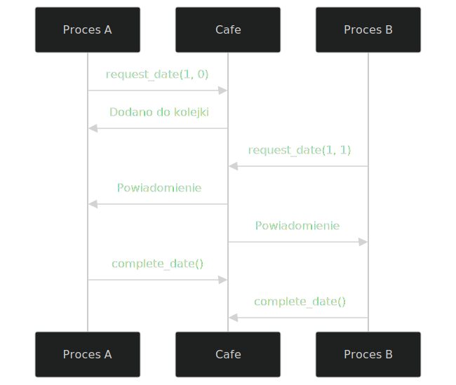

# Symulacja systemu randek procesów w kawiarni 

## Opis zadania 

Dates

In the system, there are N pairs of processes. The processes in each pair are indistinguishable. Each process cyclically performs its own tasks, and then meets with the other process from the pair in a café at a two-person table (function date()). There is only one table in the café. Processes occupy the table only when both are ready to meet, but they may leave it individually, that is, they can finish executing the date() function at different times.


## Opis projektu
Symulacja systemu, w którym `N` par procesów cyklicznie wykonuje swoje zadania, a następnie spotyka się w kawiarni przy jednym stole dwuosobowym. Procesy z tej samej pary są nierozróżnialne.

##  Budowanie projektu

   - `cmake -G Ninja -B build` → **konfiguruje** system buildowy (tworzy Makefile/Ninja)
   - `cmake --build build` → **kompiluje** kod źródłowy

```bash
# Czyszczenie semaforów
 sudo rm -f /dev/shm/sem.cafe_* /dev/shm/cafe_shm

# Czyszczenie builda (opcjonalne)
rm -rf build/

# Konfiguracja projektu (budowanie systemu plików)
cmake -G Ninja -B build -S . -DCMAKE_CXX_COMPILER=clang++-17

# Kompilacja kodu źródłowego
cmake --build build
```
## Uruchomienie

```bash
./build/cafe_modules
```

## Struktura kodu

Cafe.hpp/cpp -> Logika zarządzania spotkaniami w kawiarni

Process.hpp/cpp -> Implementacja zachowania procesów

main.cpp -> Inicjalizacja i główna pętla symulacji 

## Kluczowe koncepcje
Mechanizmy IPC
- Pamięć współdzielona (SHM). Zarządzanie przez shm_open()/mmap(). Przechowuje:
    - Kolejkę oczekujących procesów
     - Status bieżącej randki
     - Licznik aktywnych procesów

- Semafor binarny - mutex
    - Synchronizacja dostępu do współdzielonych zasobów
    - Implementacja: sem_open() z /cafe_mutex

- Semafor warunkowy - cv. Implementacja: sem_open() z /cafe_cv
    - Powiadamianie o zmianach stanu


## Wymagania
Kompilator: Clang 17+ (wymagany C++23)

Biblioteki: libc++-17-dev, ninja-build

System: Linux/WSL (testowane na Ubuntu 22.04)

C++23: Wykorzystanie <print> do formatowanego wyjścia

##  Działanie

Proces:
 - Udaje, że „pracuje” przez chwilę.

 - Próbuje umówić się na randkę ze swoją drugą połówką (czyli z procesem o tym samym pair_id).

- Jeśli się uda – „randkuje” przez chwilę.

- Kończy randkę.

- Wraca do punktu 1 — dopóki ktoś go nie zatrzyma.

Całość działa przez Cafe, która trzyma kolejkę i kontroluje, kto kiedy może „usiąść przy stoliku”.

Klasa Cafe:
- Trzyma pamięć współdzieloną (czyli dane widoczne dla wszystkich procesów).

- Używa semaforów, żeby procesy się nie „wdeptywały sobie w buty”.

- Zarządza kolejką osób czekających na randkę oraz samymi randkami.

### Co to jest semafor?
Semafor to mechanizm synchronizacji, który pozwala:

np. tylko jednemu procesowi na raz wejść do jakiegoś fragmentu kodu (mutual exclusion)
albo służy do powiadamiania innych procesów, że coś się wydarzyło (np. że randka się skończyła).

Mutex - tylko jeden proces w danej chwili modyfikował dane wspólne.
1 = oznacza, że jeden proces może wejść, potem reszta musi czekać
0 = trzeba czekać aż ten proces, co blokuje nie skończy

### Mechanizm randek procesów
1. Inicjacja spotkania

    Proces wywołuje request_date(pair_id, process_id)

    System sprawdza kolejność zgłoszeń w 3 krokach:

        a) Jeśli partner już czeka w kolejce → natychmiastowe rozpoczęcie randki
        b) Jeśli stolik zajęty przez inną parę → dodanie do kolejki oczekujących
        c) Jeśli stolik wolny → dodanie do kolejki i oczekiwanie na partnera

2. Synchronizacja



3. Zakończenie spotkania
    - Każdy proces indywidualnie wywołuje complete_date()
    - System zmniejsza licznik processes_on_date_
    - Gdy licznik osiągnie 0:
        - Zwalnia stolik (current_date_active = false)
        - Powiadamia pierwszą parę z kolejki

### Mechanizmy bezpieczeństwa
1. Kontrola dostęp
    - Wszystkie operacje na współdzielonych danych chronione przez:
    ``` cpp
    sem_wait(mutex_);
    // Operacje krytyczne
    sem_post(mutex_);
    ```

2. Komunikacja międzyprocesowa
    - Semafor warunkowy (cv_) dla efektywnego powiadamiania
    - Unikanie false wakeups przez:
    ``` cpp
    while (!partner_ready) {
    sem_wait(cv_);
}
    ```

## Parametry symulacji

- num_pair - Liczba par procesów - np. 3
- simulation_duration_seconds - Czas trwania symulacji w sekundach - np. 10
- work_dist - Losowy czas pracy procesu - np. 100-500 ms

## Moje wnioski z projektu

1. Jak działa synchornizacja
    Użyłam semaforów POSIX, żeby procesy nie wchodziły sobie w drogę. Dzięki nim mogłam „zablokować” dostęp do wspólnych danych i mieć pewność, że tylko jeden proces na raz coś zmienia.

    Kolejka do stolika zrobiłam „na piechotę” w pamięci współdzielonej — działa to jak ręcznie robiona lista oczekujących, więc każdy miał swoją kolej i nie było tak, że ktoś był pomijany.

2. Co sprawiło trudność

    Łatwo było zrobić błąd i doprowadzić do zakleszczenia (czyli że procesy czekają na siebie w nieskończoność). Musiałam bardzo uważać, kiedy dokładnie odblokowuję semafory.

    Musiałam też pilnować, żeby nie dodać dwa razy tego samego procesu do kolejki i żeby dobrze parować procesy z tej samej pary (np. 3-0 z 3-1), bo inaczej randki się nie zaczynały.

## Przykładowy scenariusz

1. Proces A z pary 1 wywołuje request_date(1, 0) - dodaje się do kolejki
2. Proces B z pary 1 wywołuje request_date(1, 1) - znajduje partnera, rozpoczyna randkę
3. Oba procesy mają randkę
4. Każdy wywołuje complete_date() gdy skończy
5. Drugi proces zwalnia stolik

Synchronizacja:

- Tylko jedna para może mieć randkę jednocześnie (jeden stolik)
- mutex chroni integralność współdzielonych struktur (SharedData) między procesami i zapobiega race condition.
- Kolejka przechowuje oczekujących

## Komunikaty wyświetlanie na konsoli

Pozwalają śledzić, co po kolei się dzieje. Ułtawiło także debugowanie :)

1. Inicjalizacja

    [MAIN] IPC resources cleaned up  # Czyści pozostałości poprzednich uruchomień

    [DEBUG] SharedData initialized by process 41359  # Proces główny inicjuje pamięć współdzieloną

2. Tworzenie procesów

    [MAIN] Created process 0-0 (PID: 41360)  # Utworzono proces 0 z pary 0 (PID 41360)

    [CHILD 0-0] Started (PID: 41360)  # Proces potomny potwierdza start

    [PID 41360] Process 0-0 starting main loop  # Proces rozpoczyna główną pętlę

3. Cykl życia procesów

    - Zgłoszenia/żądania randek

        [PID 41360] Requesting date 0-0  # Proces 0-0 chce rozpocząć randkę

        [DEBUG] Process 0-0 looking for partner, queue size: 0  # Sprawdza kolejkę (pusta)

        [DEBUG] Added 0-0 to queue, new size: 1  # Dodaje się do kolejki

        [PID 41360] Added to waiting queue 0-0  # Potwierdzenie dodania do kolejki

    - Dopasowanie par

        [DEBUG] MATCH! Found partner: 1-1 with 1-0  # Procesy 1-1 i 1-0 się dopasowały

        [DEBUG] Starting date for pair 1  # Rozpoczęcie randki pary nr 1

        [PID 41363] DATE STARTED 1-1  # Potwierdzenie rozpoczęcia randki

    - Stan kawiarni/stoilka

        [DEBUG] Table occupied by pair 1  # Stolik zajęty przez parę 1

        [DEBUG] Date already in progress for pair 1  # Proces próbuje dołączyć do trwającej randki

    - Zakończenie randki

        [PID 41362] DATE FINISHED 1-0  # Proces 1-0 kończy randkę

        [DEBUG] Process 0 completing date, processes_on_date: 2 → 1  # Aktualizacja licznika

        [DEBUG] Date completed, table is now free  # Oba procesy opuściły stolik

4. Kolejka

    [DEBUG] queue size: 5  # Bieżący rozmiar kolejki oczekujących

    [DEBUG] Added 2-0 to queue, new size: 5  # Dodanie nowego procesu do kolejki

5. Koniec

    [MAIN] Sending termination signals...  # Wysłanie SIGTERM do wszystkich procesów

    [SIGNAL] Process received termination signal  # Proces otrzymał sygnał zakończenia

    [PID 41360] Process 0-0 terminating gracefully  # Proses kończy działanie

    [MAIN] Process 41360 terminated with status 0  # Potwierdzenie poprawnego zakończenia (status 0)

    [MAIN] IPC resources cleaned up  # Usunięcie semaforów i pamięci współdzielonej


## Kod Cafe::request_date(...) - skrótowe omówienie 
 - Blokuje mutex (żeby jeden proces naraz mógł modyfikować dane).
 - Sprawdza:
    - Czy już trwa randka?
    - Czy stolik jest wolny?
    - Czy partner czeka?
- Jeśli jest partner → randka startuje!
- Jeśli nie → dodaje się do kolejki oczekujących.

## Kod  Cafe::complete_date(...) - skrótowe omówienie
- Blokuje mutex.
- Zmniejsza licznik procesów na randce.
- Jeśli był ostatni – zwalnia stolik.
- Odblokowuje mutex.

## Źródła
- https://www.geeksforgeeks.org/use-posix-semaphores-c/
- https://en.wikipedia.org/wiki/Semaphore_%28programming%29
- https://www.geeksforgeeks.org/semaphores-in-process-synchronization/
- https://www.geeksforgeeks.org/ipc-shared-memory/