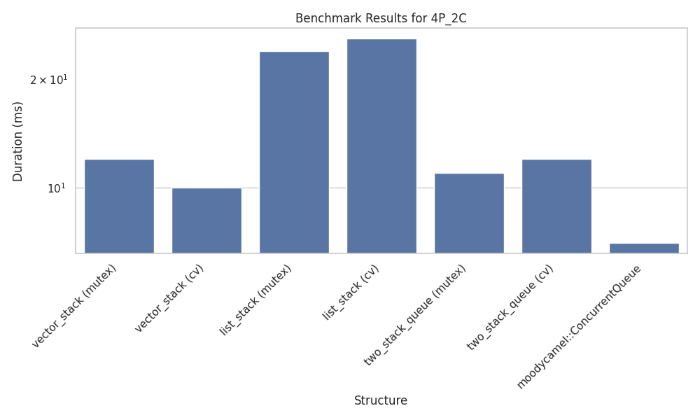
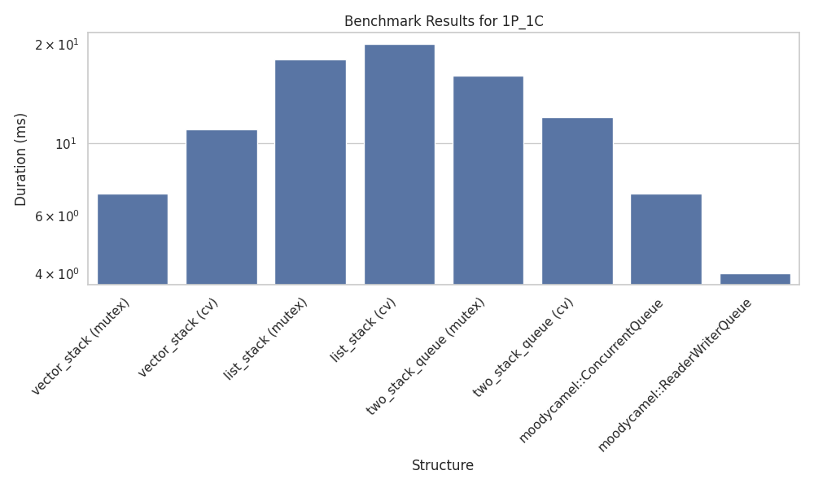
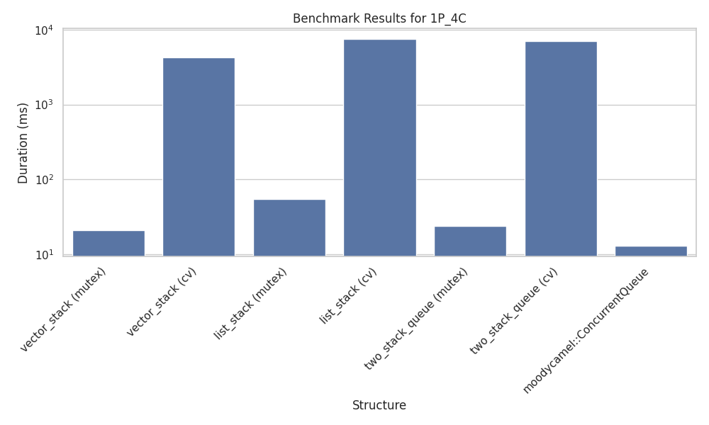
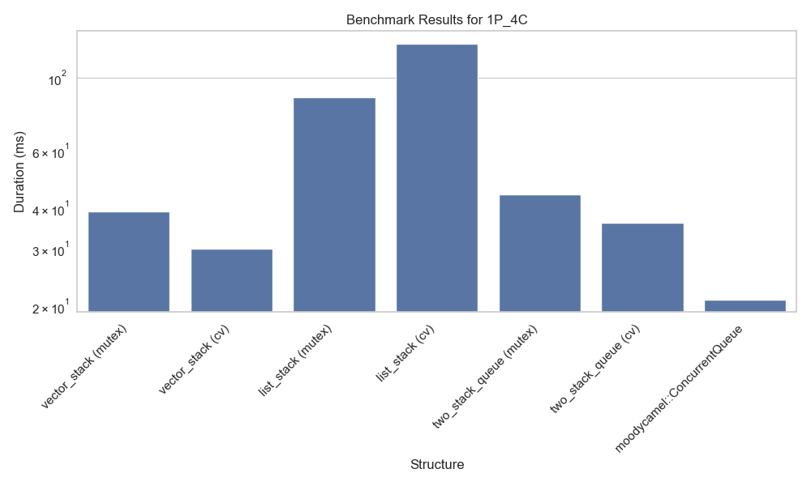

# Multi-threaded Stack and Queue Benchmarks

A comprehensive C++ benchmarking suite that compares the performance of various thread-safe stack and queue implementations under different producer-consumer scenarios.

## Overview

This project benchmarks several stack and queue implementations with different synchronization mechanisms:

### Data Structures Tested
- **Vector Stack**: Stack implementation using `std::vector`
- **List Stack**: Stack implementation using `std::list`  
- **Two-Stack Queue**: Queue implementation using two stacks
- **Lock-free Structures**: 
  - `moodycamel::ConcurrentQueue` (multi-producer, multi-consumer)
  - `moodycamel::ReaderWriterQueue` (single-producer, single-consumer)

### Synchronization Methods
- **Mutex-based**: Simple mutex locking for thread safety
- **Condition Variable**: Uses condition variables for efficient blocking/notification
- **Lock-free**: Atomic operations without explicit locking

## Requirements

### Compiler
- C++23 compatible compiler (GCC 13+, Clang 16+, MSVC 19.30+)
- Required for `std::print`, `std::format`, and other C++23 features

### Dependencies
- **moodycamel concurrent data structures**:
  - [ConcurrentQueue](https://github.com/cameron314/concurrentqueue)
  - [ReaderWriterQueue](https://github.com/cameron314/readerwriterqueue)

### Standard Library Features Used
- `std::jthread` (C++20)
- `std::print` and `std::format` (C++23)
- `std::views::cartesian_product` (C++23)
- `std::generate_n`, `std::back_inserter`
- Threading primitives (`std::mutex`, `std::condition_variable`, `std::atomic`)

## Building

### CMake (Recommended)
```bash
mkdir build && cd build
cmake ..
make -j$(nproc)
```

### Manual Compilation
```bash
# Example compilation (adjust paths as needed)
g++ -std=c++23 -O3 -pthread \
    -I ../../../external/concurrentqueue \
    -I ../../../external/readerwriterqueue \
    -I src/include/benchmarks \
    -I src/include/structures \
    -I src/include/utils \
    src/main.cpp src/benchmarks/benchmark_base.cpp \
    -o StackAndQueue

# Then run with:
./StackAndQueue
```

## Running the Benchmarks

### Basic Execution
```bash
# After building with CMake
./StackAndQueue
```

The program will:
1. Run all benchmark configurations automatically
2. Test various producer/consumer combinations (1×1, 1×2, 1×4, 2×1, 2×2, 2×4, 4×1, 4×2, 4×4)
3. Process 30,000 elements per benchmark
4. Output results to console and save to `results.csv`

### Sample Output
```
Running all benchmarks:
========================

1 producer(s), 1 consumer(s):
vector_stack (mutex): 1 producers, 1 consumers, 100000 items total - 45 ms
vector_stack (cv): 1 producers, 1 consumers, 100000 items total - 38 ms
list_stack (mutex): 1 producers, 1 consumers, 100000 items total - 52 ms
list_stack (cv): 1 producers, 1 consumers, 100000 items total - 41 ms
two_stack_queue (mutex): 1 producers, 1 consumers, 100000 items total - 35 ms
two_stack_queue (cv): 1 producers, 1 consumers, 100000 items total - 28 ms
moodycamel::ConcurrentQueue: 1 producers, 1 consumers, 100000 items total - 15 ms
moodycamel::ReaderWriterQueue: 1 producers, 1 consumers, 100000 items total - 8 ms

2 producer(s), 2 consumer(s):
[... additional results ...]
```

## Results Analysis

### Performance Characteristics
- **Lock-free structures** typically show best performance
- **Vector-based structures** often faster than list-based for stack operations
- **Single producer/consumer** scenarios favor specialized implementations

### Plot Examples Schowcasing Characteristics


As expected, vector-based implementation of stack yields far better results than it's list-based counterpart.



As seen here in case of single producer single consumer scenario specialized implementation yields far better results.


Lock-free implementation proved to generally provide the best performance.


Benchmark ran on WSL

Benchmark ran on Windows

During benchmarking on WSL it turned out that in configurations where number of consumers is greater than number of producents the cv-based implementations severely underperform. Comparing results to the same benchmark ran in Windows environment proved the issue to be system-specific. It might have to do with how WSL gets access to hardware where communication between schedulers of both Windows and WSL severely slows the process down.
